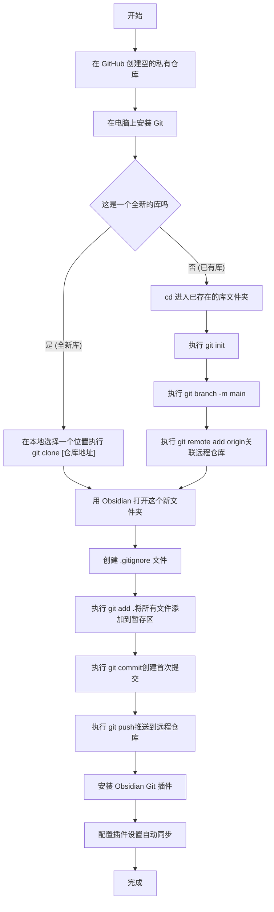

# Obsidian Git 同步配置指南 (桌面端)


**核心优势**:
- **版本控制**: 每次提交都是一个快照，你可以随时回溯到任何历史版本，是防止误删、误改的最强保险。
- **免费可靠**: 利用 GitHub/Gitee 等平台的免费私有仓库，成本为零。
- **无冲突风险**: Git 强大的分支和合并机制能专业地处理冲突，远优于普通网盘。
- **可以尽情折腾插件外观**: 依托于Git 强大的分支和合并机制。

**核心劣势**:
- **手机端不给力**: 需要借助第三方工具，麻烦且收费。
- **不适合大量二进制文件存储**: 比如音频，视频，图片。


## 前提条件

1.  **一个 GitHub/Gitee 账号**: 用于托管你的远程私有仓库。
2.  **在你的电脑上已安装 Git**: 可以从 [git-scm.com](https://git-scm.com/downloads) 下载安装。

---

## 步骤简介
| 步骤 | 核心任务 | 全新仓库的操作 | 已有仓库的操作 |
| :--- | :--- | :--- | :--- |
| **1** | **创建云端仓库** | 在 GitHub/Gitee 创建一个空的**私有**仓库。 | (同左) |
| **2** | **建立本地仓库** | 在本地选好位置，执行 `git clone [仓库地址]`。 | `cd` 进入库文件夹，执行 `git init`。 |
| **3** | **关联云与本地** | `clone` 命令已自动完成此步骤。 | 执行 `git remote add origin [仓库地址]`。 |
| **4** | **创建忽略规则** | 在库的根目录创建 `.gitignore` 文件。 | (同左) |
| **5** | **首次推送内容** | 执行 `git add`, `commit`, `push` 命令。 | (同左) |
| **6** | **实现自动化** | 安装并配置 `Obsidian Git` 插件，设置自动同步。 | (同左) |


## 详细配置步骤

### 步骤一：创建远程私有仓库

1.  注册、登录 **GitHub** (或 Gitee)。
2.  点击右上角的 `+` 号，选择 `New repository`。
3.  **Repository name**: 建议使用你的库名称，例如 `my-obsidian-vault`。
4.  **设置为 `Private`**: **至关重要！** 确保你的笔记不会被公开访问。
5.  **不要**勾选任何 "Initialize this repository with..." 的选项（如 README, .gitignore）。我们需要一个完全空的仓库来接收我们已有的本地内容。
6.  点击 `Create repository`。创建后，复制页面上提供的 **HTTPS** 地址备用。
7. 安装Git

### 步骤二：初始化本地仓库

接下来，我们要把你本地的 Obsidian 库文件夹变成一个 Git 仓库。

1.  打开你电脑的终端 (Terminal, PowerShell, CMD)。
2.  使用 `cd` 命令进入你的 Obsidian 库所在的文件夹。（这里也可以打开文件夹后，右键点击文件夹空白处，选择`Open Git Bash Here`）
    ```bash
    # 示例 (请替换为你的真实路径)
    cd ~/Documents/MyVault
    ```
3.  执行 `git init` 命令，这会在当前文件夹下创建一个 `.git` 子文件夹，标志着本地仓库创建成功。
    ```bash
    git init
    ```
4.  (推荐) 将默认分支名从 `master` 修改为 `main`，这是目前社区的推荐做法。
    ```bash
    git branch -m main
    ```
5. 将你的本地仓库与第一步创建的远程仓库关联起来。
    ```bash
    # 将 [你的远程仓库地址] 替换为你之前复制的 URL
    git remote add origin [你的远程仓库地址]
    ```

**如果你尚未创建任何Obsidian vault，那么你可以直接新建一个文件夹（比如MyVault），在这个文件夹里的空白处点击右键，选择`Open Git Bash Here`，然后执行命令`git clone [你的远程仓库地址]`，然后，在obsidian中打开这个文件夹即可。**

### 步骤三：创建 `.gitignore` 文件

此文件用于告诉 Git 哪些文件或文件夹**不需要**被同步，以保持仓库干净并避免不必要的冲突。

1.  在你的库根目录（与 `.obsidian` 文件夹同级）创建一个名为 `.gitignore` 的文件。
2.  打开该文件，粘贴以下推荐内容：
```
# 忽略操作系统自动生成的文件
.DS_Store
Thumbs.db

# 忽略Obsidian的缓存文件
.obsidian/cache

# 忽略特定设备的工作区状态，这是避免冲突的关键
# 这是你本次操作的核心目标
.obsidian/workspace.json
.obsidian/workspaces.json
.obsidian/workspace-mobile.json

# 忽略其他不建议同步的文件
.obsidian/daily-notes.json
.obsidian/facets.json
.obsidian/starred.json

# 忽略插件的缓存和数据文件 (可选，但推荐)
# .obsidian/plugins/some-plugin/data.json
.obsidian/plugins/recent-files-obsidian/data.json

# 忽略垃圾箱文件夹
.trash/
```

### 步骤四：首次提交与推送

这是将你本地的所有笔记首次上传到 GitHub 的关键一步。

1.  回到终端，将所有文件添加到暂存区。
    ```bash
    git add .
    ```
2.  提交这些文件，并附上一条描述信息。
    ```bash
    git commit -m "Initial commit: Add all vault files"
    ```
3.  将本地的 `main` 分支内容推送到远程 `origin` 仓库，并建立跟踪关系。
    ```bash
    git push -u origin main
    ```
    执行此步时，可能会提示你输入 GitHub 的用户名和密码（实际上是 **Personal Access Token**）。

### 步骤五：安装并配置 `Obsidian Git` 插件

最后一步是让 Obsidian 自动为我们执行 Git 操作。

1.  在 Obsidian 中，进入 `设置` -> `第三方插件` -> `社区插件市场`。
2.  搜索 `Obsidian Git`，点击 `安装`，然后 `启用`。
3.  进入 `Obsidian Git` 的设置页面，进行以下核心配置：
- **Pull on startup**: 启动时拉取更新。防止多设备内容冲突的核心功能，必须开启。
- **Auto commit interval (minutes)**: 自动提交间隔。设置大于0的值（如10），以启用后台自动备份到本地。
- **Push on commit-and-sync(在“提交并同步”时推送)**: 默认是开启的，保持开启即可。


至此，全部配置完成！你的 Obsidian 库已经拥有了强大的 Git “超能力”，可以安心地在多台电脑上写作了。你也可以通过命令面板 (`Ctrl/Cmd + P`) 手动执行 `Git: Push` 等命令。


## 流程图

